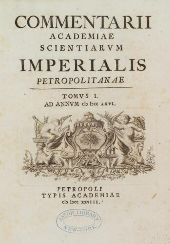

[](https://tei-c.org/) [](https://en.wikipedia.org/wiki/18th_century) [](https://en.wikipedia.org/wiki/Latin) [](https://creativecommons.org/licenses/by/4.0/)

# Commentarii Academiae Scientiarum Imperialis Petropolitanae: Editio Digitalis

Электронное научное издание «Записки Императорской Санкт-Петербургской академии наук: Цифровое издание».



## О проекте

*Commentarii Academiae Scientiarum Imperialis Petropolitanae* — научный журнал, издававшийся Императорской Санкт-Петербургской академией наук с 1728 года. В журнале публиковались статьи по математике, физике, астрономии, анатомии, естественной истории, истории и т. п.

Настоящее электронное издание представляет собой цифровую публикацию томов журнала. В издание включаются **только тексты на латинском языке**; статьи на других языках (немецком, французском и др.) в издание не входят.

Тексты транскрибированы, исправлены от ошибок OCR, размечены в формате TEI P5 и снабжены метаданными, пригодными для машинной обработки и научного цитирования.

## Источники

Сканы томов взяты из открытых цифровых коллекций:

- **Internet Archive** — основной источник PDF-файлов (например, [Том I](https://archive.org/download/commentariiacade01impe/commentariiacade01impe_bw.pdf)).
- **British Museum (Natural History), Лондон** — экземпляр, с которого сделан скан Тома I.

Каждый том в издании снабжён ссылкой на источник в `<sourceDesc>`.

## Принципы транскрипции

- Ошибки OCR исправлены; исправления не отмечаются в тексте, но оригинальные написания могут быть восстановлены по сканам.
- Лигатуры (например, `CIƆ IƆ` для дат, `æ`, `œ`) раскрыты в тексте.
- Разночтения и спорные места документируются в `<note>`.

## Формат и стандарты

- **TEI P5** (Text Encoding Initiative) — основной формат разметки.
- Каждый документ — автономный `<TEI>`-файл с собственным `<teiHeader>`.
- Контейнеры `commentarii.xml` и `tomus1.xml` связывают документы через **XInclude**.
- Кодировка — **UTF-8**.
- Метаданные включают автора, название, источник, язык, лицензию и сведения об издателе.

## Состав издания

### Том I (1728)

**Начальные материалы:**

- Титульный лист
- Посвящение Петру II (Христиан Гольдбах)
- Предисловие (Христиан Гольдбах)
- Оглавление тома (*Index Commentariorum*)

**Classis Prima continens Mathematica:**

1. Якоб Герман. О мере сил тел (*De Mensura virium Corporum*) — с. 1–42
2. Георг Бернхард Бюльфингер. О силах, присущих движущемуся телу, и их мере (*De Viribus corpori moto insitis et illarum Mensura*) — с. 43–120
3. Николай Бернулли. О движении тел от удара (*De Motu corporum ex percussione*) — с. 121–126
4. Даниил Бернулли. Исследование начал механики (*Examen Principiorum Mechanicae*) — с. 126–140
5. Якоб Герман. О задаче Кеплера (*De Problemate Kepleriano*) — с. 142–149
6. Якоб Герман. Об интегральном исчислении (*De Calculo Integrali*) — с. 149–166
7. Иоганн Бернулли. Об интегрировании дифференциальных уравнений (*De Integrationibus Aequationum Differentialium*) — с. 167–184
8. Христиан Гольдбах. О некоторых случаях интегрируемости (*De Casibus quibusdam integrabilibus*) — с. 185–197
9. Николай Бернулли. Анализ некоторых дифференциальных уравнений (*Analysis Aequationum quarundam Differentialium*) — с. 198–207
10. Христиан Гольдбах. Метод интегрирования дифференциального уравнения (*Methodus integrandi Aequationem differentialem*) — с. 207–209
11. Якоб Герман. О сферических эпициклоидах (*De Epicycloidibus Sphaericis*) — с. 210–217
12. Христиан Вольф. Начала динамики (*Principia Dynamica*) — с. 217–232

**Classis Secunda continens Physica:**

13. Иоганн Христиан Буксбаум. Новые роды растений (*Nova Plantarum genera*) — с. 241–245
14. Георг Бернхард Бюльфингер. О направлении тяжёлых тел в сферическом вихре (*De directione Corporum gravium in vortice Sphaerico*) — с. 245–261
15. Иоганн Георг Дю Вернуа. Описание млечных сосудов (*Descriptio Vasorum Chyliferorum*) — с. 262–296
16. Даниил Бернулли. Опыт новой теории движения мышц (*Tentamen novae de motu Musculorum Theoriae*) — с. 297–312
17. Даниил Бернулли. Эксперимент относительно зрительного нерва (*Experimentum circa nervum opticum*) — с. 314–317
18. Георг Бернхард Бюльфингер. О различных более чувствительных барометрах (*De variis Barometris sensibilibus*) — с. 317–341
19. Иоганн Георг Дю Вернуа. О грудном протоке кашалота, тюленя и слона (*De Cisterna et ductu Thoracico Catopardi, Phocae et Elephanti*) — с. 342–350
20. Фридрих Христофор Мейер. О северном сиянии (*De Luce Boreali*) — с. 351–367
21. Пётр Антоний Микелотти. История редкой и почти неслыханной болезни матки (*Rari ac prope inauditi ex utero morbi historia*) — с. 368–378
22. Анатомические наблюдения (*Observationes Anatomicae*) — с. 379–386

**In Classe Historica:**

23. Теофил Сигфрид Байер. О происхождении и древних местах обитания скифов (*De origine et priscis sedibus Scytharum*) — с. 387–399
24. Теофил Сигфрид Байер. О положении Скифии во времена Геродота (*De situ Scythiae sub aetatem Herodoti*) — с. 400–424
25. Теофил Сигфрид Байер. О Кавказской стене (*De Muro Caucaseo*) — с. 425–464
26. Иосиф Николай Делиль и Людовик Делиль де ла Круайер. Астрономические наблюдения (*Observationes Astronomicae*) — с. 465 и далее

Последующие тома добавляются по мере обработки.

## Структура репозитория

```
commentarii/
├── README.md
├── LICENSE
├── CITATION.cff
├── xml/
│   ├── commentarii.xml          # Контейнер всего издания
│   ├── tomus1/
│   │   ├── tomus1.xml           # Контейнер Тома I
│   │   ├── tomus1_titulus.xml   # Титульный лист
│   │   ├── tomus1_dedicatio.xml # Посвящение
│   │   ├── tomus1_praefatio.xml # Предисловие
│   │   └── ...                  # Статьи Тома I
│   └── ...
├── images/
│   └── tomus1/                  # Изображения со страниц
└── docs/                        # GitHub Pages
```

## Участие и обратная связь

Если вы нашли ошибку в транскрипции или хотите предложить улучшение — создайте issue в [репозитории](https://github.com/nevmenandr/commentarii) или напишите редактору.

## Лицензия

Издание распространяется на условиях лицензии **Creative Commons Attribution 4.0 International (CC BY 4.0)**. Вы можете свободно использовать, распространять и адаптировать материалы при условии указания авторства.

## Цитирование

Если вы используете это издание в научной работе, пожалуйста, ссылайтесь на него следующим образом:

```
Орехов, Борис. Commentarii Academiae Scientiarum Imperialis Petropolitanae: Editio Digitalis. 2026. URL: https://github.com/nevmenandr/commentarii
```

Машиночитаемая информация для цитирования доступна в файле [`CITATION.cff`](CITATION.cff).


## Аннотация

### Русский

Электронное научное издание «Записки Императорской Санкт-Петербургской академии наук: Цифровое издание» представляет собой цифровую публикацию томов научного журнала *Commentarii Academiae Scientiarum Imperialis Petropolitanae*, издававшегося Императорской Санкт-Петербургской академией наук с 1728 года. В издание включаются только тексты на латинском языке — статьи по математике, физике, астрономии, анатомии, естественной истории и истории. Тексты транскрибированы, исправлены от ошибок OCR и размечены в формате TEI P5.

### English

A digital edition of the *Commentarii Academiae Scientiarum Imperialis Petropolitanae*, the proceedings of the Imperial St. Petersburg Academy of Sciences, originally published in the 18th century. The edition includes only Latin texts — articles on mathematics, physics, astronomy, anatomy, natural history, and history. The texts are transcribed, corrected from OCR errors, and encoded in TEI P5.

### Latina

Editio digitalis *Commentariorum Academiae Scientiarum Imperialis Petropolitanae*, actorum Academiae Scientiarum Imperialis Petropolitanae, saeculo duodevicesimo editorum. Haec editio solos textus Latinos complectitur — commentarios de mathesi, physica, astronomia, anatomia, historia naturali atque historia. Textus transcripti, erroribus OCR purgati, et in forma TEI P5 expressi sunt.

## Контакты

[Борис Орехов / Boris Nuceus / Boris Orekhov](https://nevmenandr.github.io/): 

[](https://bsky.app/profile/nevmenandr.bsky.social) [](https://mastodon.social/@nevmenandr) [](https://t.me/schonenrede) [](https://x.com/nevmenandr) [](https://www.youtube.com/@schonenrede/)

[](https://hse-ru.academia.edu/BorisOrekhov) [](https://arxiv.org/search/cs?searchtype=author&query=Orekhov,+B) [](https://dev.to/nevmenandr) [](https://www.scopus.com/authid/detail.uri?authorId=57190401804) [](https://habr.com/ru/users/nevmenandr/) [](https://huggingface.co/nevmenandr) [](https://orcid.org/0000-0002-9099-0436) [](https://osf.io/phy74/) 

[](https://pypi.org/user/nevmenandr/) [](https://researchgate.net/profile/Boris-Orekhov) [](https://www.semanticscholar.org/author/Boris-V.-Orekhov/2080424505)  [](https://ru.wikipedia.org/wiki/%D0%A3%D1%87%D0%B0%D1%81%D1%82%D0%BD%D0%B8%D0%BA:Nevmenandr)


